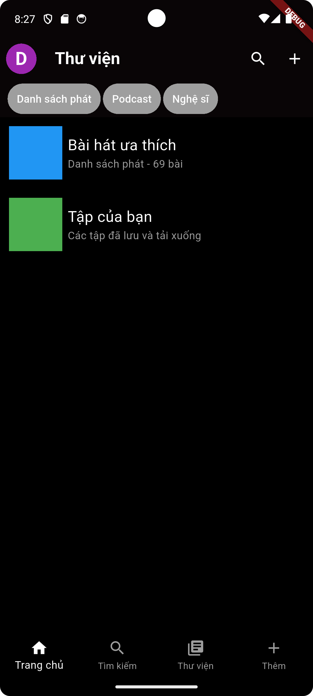

# spotify_clone

clone ứng dụng spotify

## Trạng thái dự án

Giao diện màn hình thư viện,  
Giao diện get started khi lần đầu mở ứng dụng, thêm cài đặt giao diện sáng tôi nhưng chưa điều chỉnh được

## Ảnh giao diện hiện tại

## Hướng dẫn chạy app

bash
    git clone https://github.com/puipui0909/spotify_clone.git
    cd spotify_clone
    flutter pub get
    flutter run

## Cấu trúc thư mục
lib/  
>main.dart  
>Screens/  
   >library.dart  
>theme/  
   >theme.dart 
   >theme_notifier.dart 