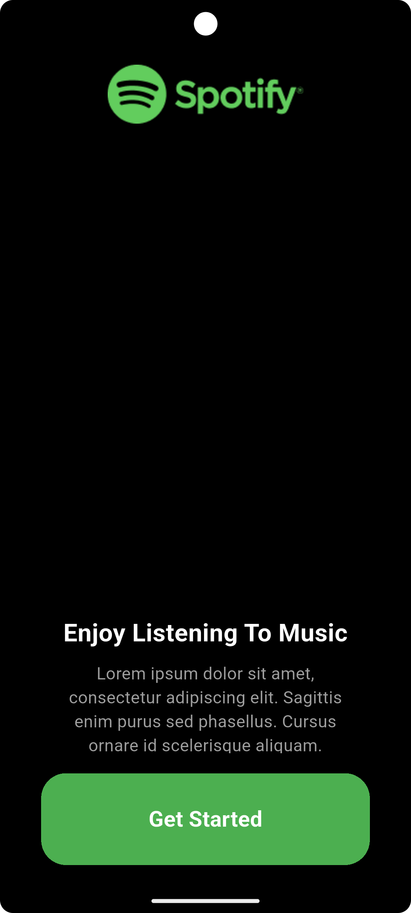
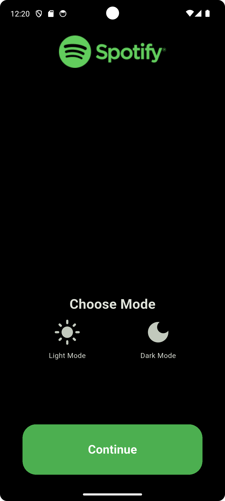
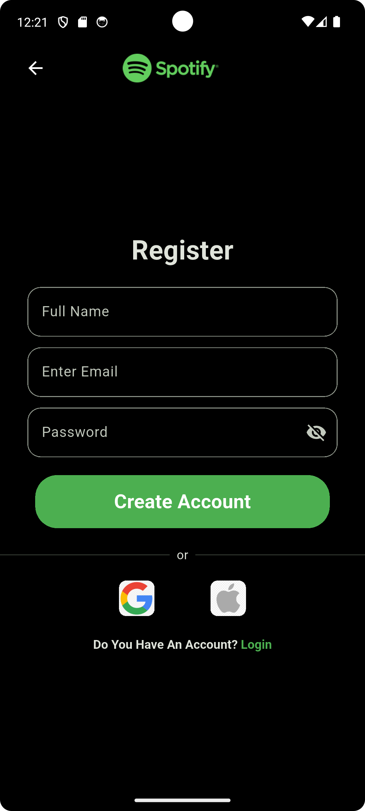
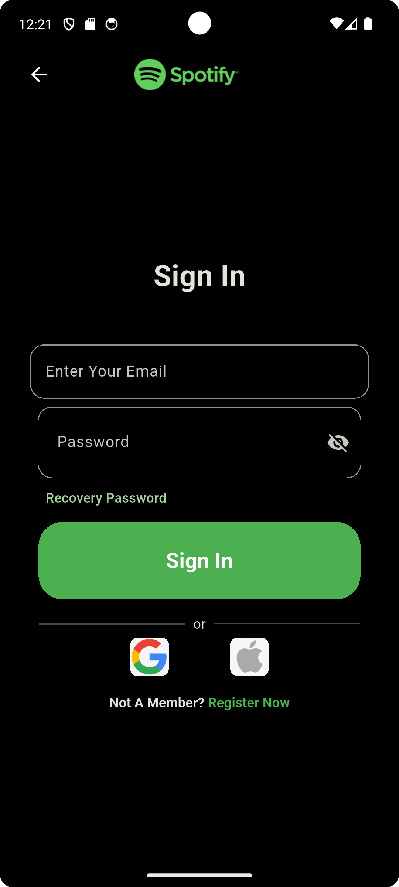
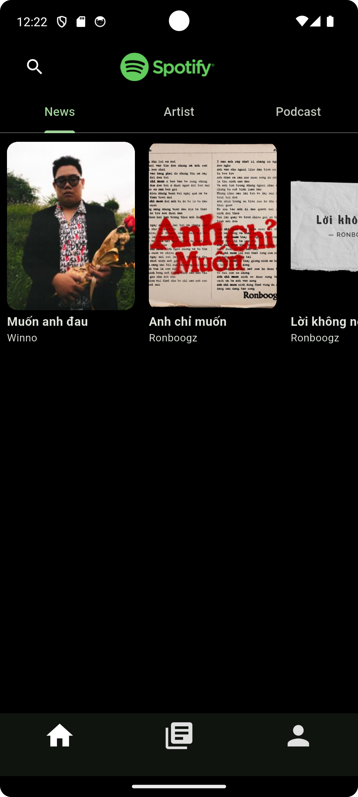
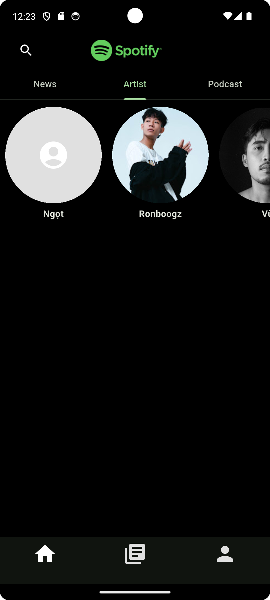
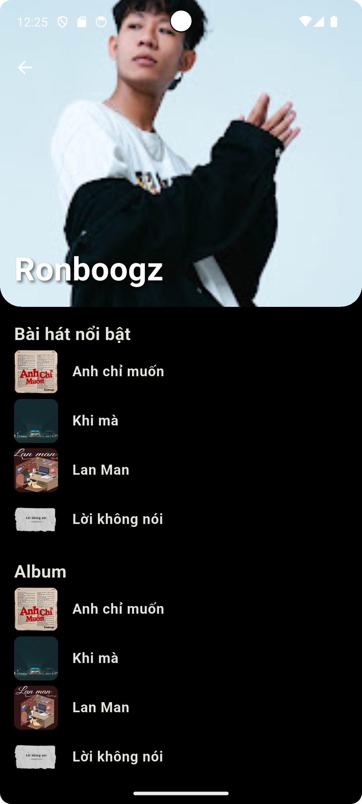

# spotify_clone

Music player simulating the Spotify app

## 
Project status

Implemented user authentication (sign up & login) with Firebase Authentication, and managed songs, albums, and artists data with Firestore. 
Implemented music playback using just_audio. 

## UI/UX Showcase

## Hướng dẫn chạy app

bash
    git clone https://github.com/puipui0909/spotify_clone.git
    cd spotify_clone
    flutter pub get
    flutter run

## Cấu trúc thư mục
|   firebase_options.dart
|   main.dart
|   structure.txt
|   
+---features
|   \---search
|           my_search_delegate.dart
|           search_service.dart
|           
+---models
|       album.dart
|       artist.dart
|       song.dart
|       
+---Screens
|       artist_screen.dart
|       choose_theme_screen.dart
|       get_started_screen.dart
|       home_screen.dart
|       library.dart
|       player_screen.dart
|       register_or_signin.dart
|       register_screen.dart
|       signin_screen.dart
|       
+---service
|       player_service.dart
|       
+---theme
|       theme.dart
|       theme_notifier.dart
|       
\---widgets
    |   custom_appbar.dart
    |   items.dart
    |   
    \---register_and_sigin
            auth_redirect_text.dart
            field_button.dart
            or_divider.dart
            social_login_button.dart
            text_field.dart